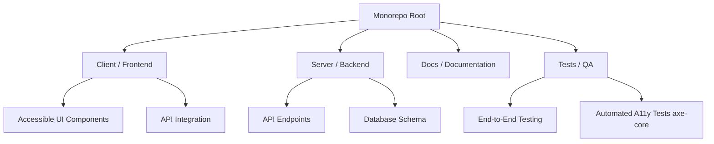

# Accessibility Audit & Architecture Report

## 1. Audit Overview
**Target:** City Services Portal (Sample)
**Methodology:** Chrome Lighthouse Audit + Manual Keyboard-Only Navigation
**Date:** September 23, 2026

## 2. Key Findings

Below is a summary of the 5 key accessibility issues identified. A detailed CSV worksheet is provided in the root directory (`accessibility-audit-report.csv`).

| Issue ID | Component | WCAG Reference | Severity | Recommended Fix |
| :--- | :--- | :--- | :--- | :--- |
| **WEB-001** | Header Navigation | 2.1.1 Keyboard | High | Implement keyboard event listeners for dropdowns. |
| **WEB-002** | Contact Form | 3.3.2 Labels or Instructions | High | Add `<label>` elements matching input `id`s. |
| **WEB-003** | Homepage Banner | 1.4.3 Contrast (Minimum) | Medium | Increase background contrast to meet 4.5:1 ratio. |
| **WEB-004** | Footer | 1.1.1 Non-text Content | Medium | Add `aria-label`s to social media icons. |
| **WEB-005** | Main Content Links | 2.4.7 Focus Visible | Medium | Add `:focus-visible` outline styles. |

## 3. Screenshots Evidence
Place your screenshots of the Lighthouse report and specific component issues inside the `docs/screenshots` folder.

## 4. Proposed Architecture Tree

To remediate these issues and build a maintainable full-stack project foundation, we are adopting a Monorepo architecture.

